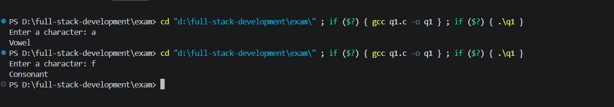
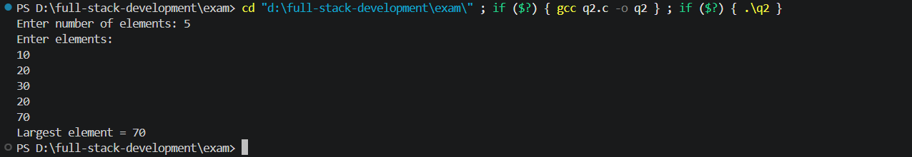
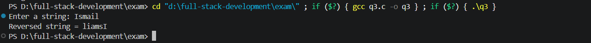
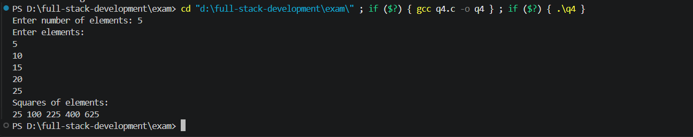
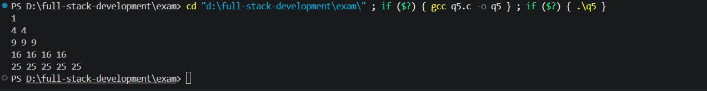

# C Language - Practical Exam

This repository contains solutions for the **C Language Practical Exam**.

## Questions

1. Check whether a character is a vowel or consonant using a `switch` statement.
2. Find the largest element in a 1D array.
3. Reverse a string using a function without using library functions.
4. Find the square of each element of a 1D array using a pointer.
5. Print the given pattern using nested `for` loops.

---

## Q1. Vowel or Consonant Using Switch

### Source Code

```c
#include <stdio.h>

int main()
{
    char ch;

    printf("Enter a character: ");
    scanf(" %c", &ch);

    switch(ch)
    {
        case 'a':
        case 'e':
        case 'i':
        case 'o':
        case 'u':
        case 'A':
        case 'E':
        case 'I':
        case 'O':
        case 'U':
            printf("Vowel");
            break;

        default:
            printf("Consonant");
    }

    return 0;
}
```

### Output



---

## Q2. Largest Element in 1D Array

### Source Code

```c
#include <stdio.h>

int main()
{
    int a[100], n, i, largest;

    printf("Enter number of elements: ");
    scanf("%d", &n);

    printf("Enter elements:\n");
    for(i = 0; i < n; i++)
    {
        scanf("%d", &a[i]);
    }

    largest = a[0];

    for(i = 1; i < n; i++)
    {
        if(a[i] > largest)
        {
            largest = a[i];
        }
    }

    printf("Largest element = %d", largest);

    return 0;
}
```

### Output



---

## Q3. Reverse a String Without Library Functions

### Source Code

```c
#include <stdio.h>

void reverse(char str[])
{
    int i, length = 0;
    char temp;

    while(str[length] != '\0')
    {
        length++;
    }

    for(i = 0; i < length / 2; i++)
    {
        temp = str[i];
        str[i] = str[length - i - 1];
        str[length - i - 1] = temp;
    }
}

int main()
{
    char str[100];

    printf("Enter a string: ");
    scanf("%s", str);

    reverse(str);

    printf("Reversed string = %s", str);

    return 0;
}
```

### Output



---

## Q4. Square of Each Array Element Using Pointer

### Source Code

```c
#include <stdio.h>

int main()
{
    int a[100], n, i;
    int *p;

    printf("Enter number of elements: ");
    scanf("%d", &n);

    printf("Enter elements:\n");
    for(i = 0; i < n; i++)
    {
        scanf("%d", &a[i]);
    }

    p = a;

    printf("Squares of elements:\n");

    for(i = 0; i < n; i++)
    {
        printf("%d ", (*p) * (*p));
        p++;
    }

    return 0;
}
```

### Output



---

## Q5. Pattern Using Nested For Loop

### Source Code

```c
#include <stdio.h>

int main()
{
    int i, j;

    for(i = 1; i <= 5; i++)
    {
        for(j = 1; j <= i; j++)
        {
            printf("%d ", i * i);
        }

        printf("\n");
    }

    return 0;
}
```

### Output



---

## Technologies Used

- **Language:** C
- **Concepts:** `switch`, arrays, functions, strings, pointers, nested `for` loops
- **Compiler:** GCC / VS Code with C compiler

